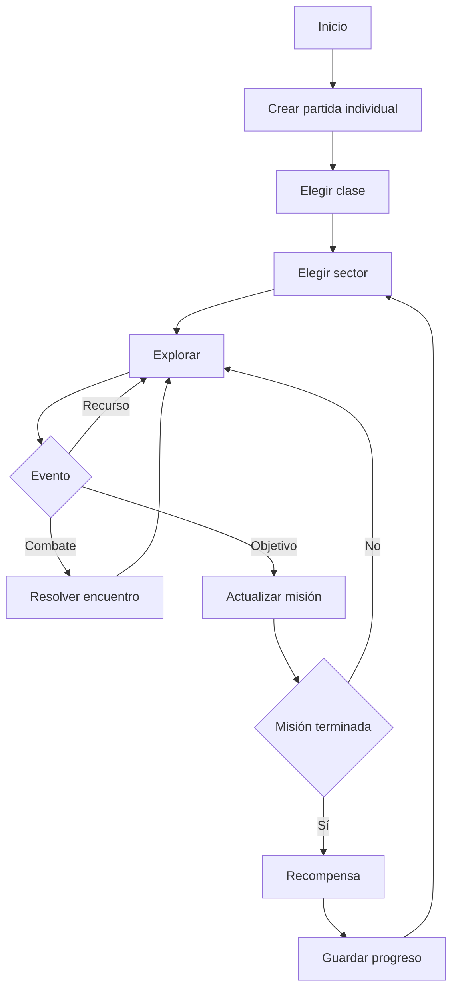
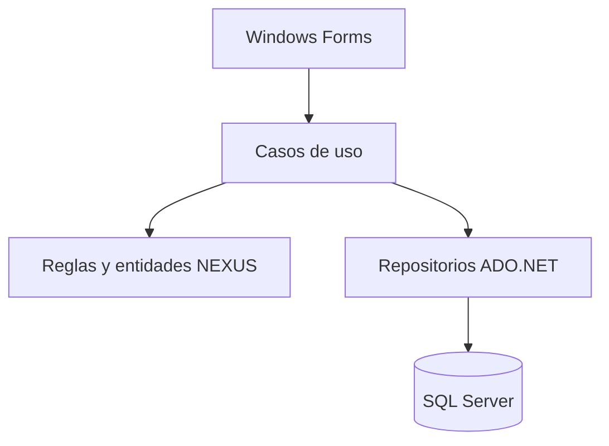
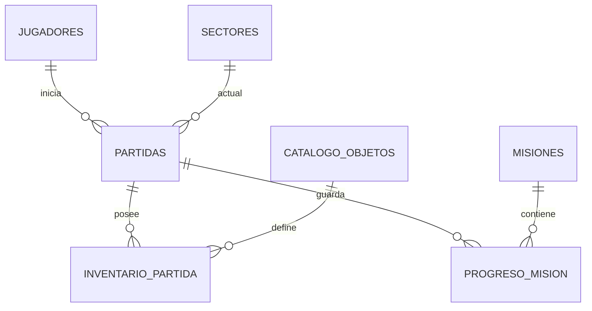

# Evidencias: diagramas técnicos de NEXUS

## Flujo de partida

```mermaid
flowchart TD
 A[Inicio] --> B[Crear partida individual]
 B --> C[Elegir clase]
 C --> D[Elegir sector]
 D --> E[Explorar]
 E --> F{Evento}
 F -->|Recurso| E
 F -->|Combate| G[Resolver encuentro]
 G --> E
 F -->|Objetivo| H[Actualizar misión]
 H --> I{Misión terminada}
 I -->|No| E
 I -->|Sí| J[Recompensa]
 J --> K[Guardar progreso]
 K --> D
```

## Arquitectura por capas

```mermaid
flowchart TB
 UI[Windows Forms] --> APP[Casos de uso]
 APP --> DOM[Reglas y entidades NEXUS]
 APP --> DATA[Repositorios ADO.NET]
 DATA --> DB[(SQL Server)]
```

## Modelo relacional

```mermaid
erDiagram
 JUGADORES ||--o{ PARTIDAS : inicia
 PARTIDAS ||--o{ INVENTARIO_PARTIDA : posee
 CATALOGO_OBJETOS ||--o{ INVENTARIO_PARTIDA : define
 PARTIDAS ||--o{ PROGRESO_MISION : guarda
 MISIONES ||--o{ PROGRESO_MISION : contiene
 SECTORES ||--o{ PARTIDAS : actual
```
